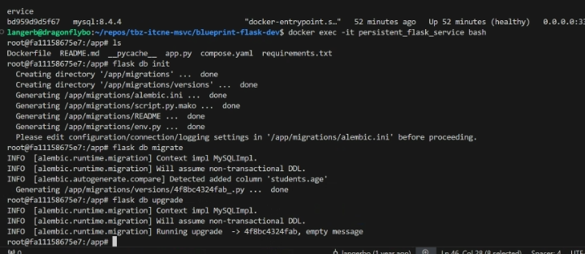

# Modul-MSVC

## Minimal Flask Server

https://gitlab.com/ch-tbz-wb/Stud/MSVC/-/blob/main/2_Unterrichtsressourcen/B_Microservices_lokal/01_minimal_dockerized_flask.md?ref_type=heads

Hier ist die Zusammenfassung im **Markdown-Format**:  


# Python und API-Entwicklung

Python ist eine vielseitige Programmiersprache, die sich besonders für die API-Entwicklung eignet. Beliebte Frameworks dafür sind **Django, Flask und FastAPI**:

- **Django**: Vollumfängliches Framework mit vielen integrierten Features.
- **Flask**: Minimalistisches Framework, das flexibel durch externe Bibliotheken erweitert werden kann.
- **FastAPI**: Moderne Lösung mit **Asynchronität** und **Typhinweisen**, besonders schnell.

Der Autor bevorzugt **Flask und FastAPI** und gibt Tipps zur API-Entwicklung mit Flask.

---

## Best Practices für API-Entwicklung

### 1. Klare und konsistente Endpunkt-Namen und HTTP-Verben

- **Ressourcen sollten als Plural-Nomen benannt werden** (z. B. `/users`, `/users/{userId}`).
- **Trennzeichen**:
  - **Bindestriche (`-`)** für bessere Lesbarkeit (`/users/{userId}/mobile-devices`).
  - **Schrägstriche (`/`)** zur Darstellung der Hierarchie.
  - **Kleinbuchstaben** für URLs.
- **CRUD-Operationen mit HTTP-Verben**:
  - `GET /users` → Liste aller Nutzer
  - `POST /users` → Neuen Nutzer erstellen
  - `PUT /users/{userId}` → Nutzer aktualisieren
  - `DELETE /users/{userId}` → Nutzer löschen
  - `PATCH /users/{userId}` → Teilweise Aktualisierung

🚫 **Falsch**:
`/users/get-all`, `/users/create`, `/users/{userId}/list-orders`.

---

### 2. Strukturierung der Anwendung

Es gibt keine feste Regel für den Aufbau einer Flask-Anwendung, aber eine bewährte Struktur ist:

```plaintext
project/
│── api/
│   ├── model/
│   ├── route/
│   ├── schema/
│   ├── service/
│── test/
│   ├── route/
│── app.py
│── Pipfile
│── .gitignore
```

- **Models**: Datenbeschreibungen (z. B. Datenbank-Modelle).
- **Routes**: Definiert API-Endpunkte.
- **Schemas**: Validierung der Eingaben/Ausgaben.
- **Services**: Geschäftslogik, um den Code in Routen schlank zu halten.

Blueprints helfen dabei, Routen zu organisieren:

```python
home_api = Blueprint('api', __name__, url_prefix='/home-service')
```

---

### 3. Automatische API-Dokumentation mit Swagger

Anstatt Dokumentation manuell zu schreiben, kann **Swagger** genutzt werden:

- **Flasgger** ist eine Bibliothek für Flask, die automatisch interaktive API-Dokumentation erstellt.
- **Swagger-Daten** werden aus Code-Kommentaren und `@swag_from` Annotationen bezogen.

```python
@swag_from({
    'responses': {
        HTTPStatus.OK.value: {
            'description': 'Welcome message',
            'schema': WelcomeSchema
        }
    }
})
```

---

### 4. Test-Driven Development (TDD)

Tests sind wichtig für stabile APIs. **TDD (Test-Driven Development)** bedeutet:

1. **Test zuerst schreiben**:

    ```python
    def test_answer():
        assert sum_two_numbers(3, 5) == 8
    ```

2. **Code schreiben, damit der Test besteht**:

    ```python
    def sum_two_numbers(num1, num2):
        return num1 + num2
    ```

3. **Test ausführen** – Falls er fehlschlägt, Code korrigieren.

---

## Fazit

Es gibt nicht **die eine** richtige Methode für API-Entwicklung, aber **Konsistenz, Modularität, Dokumentation und Tests** sind essenziell.  
Durch die Befolgung dieser Best Practices kann man **effizienter APIs entwickeln und deren Qualität steigern**. 🚀

Dieses Markdown-Format kann direkt in einem Markdown-Editor oder GitHub verwendet werden.

# CRUD

Die CRUD-Operationen (Create, Read, Update, Delete) sind grundlegende Funktionen beim Aufbau von APIs, die es ermöglichen, Daten zu erstellen, abzurufen, zu aktualisieren und zu löschen. Diese vier Operationen sind oft notwendig, um ein vollständiges und benutzbares Modell zu schaffen. Wenn eine Aktion nicht durch eine dieser vier Operationen beschrieben werden kann, sollte sie möglicherweise als eigenes Modell betrachtet werden.

Im Zusammenhang mit REST-APIs entsprechen CRUD-Operationen oft den HTTP-Methoden POST (Create), GET (Read), PUT (Update) und DELETE (Delete). Dies sind fundamentale Elemente für ein persistenten Speichersystem.

Beispiel eines RESTful Systems für ein Restaurantmenü:
- Create: Um ein neues Gericht hinzuzufügen, wird eine POST-Anforderung verwendet. Der Server antwortet mit einem HTTP-Code 201 (Created).
- Read: Mit GET wird die gesamte Liste von Gerichten oder ein spezifisches Gericht abgerufen, ohne dass Daten verändert werden. Erfolgreiche Anfragen erhalten den Statuscode 200 (OK).
- Update: PUT wird verwendet, um ein Gericht zu aktualisieren, wie z. B. eine Preisänderung. Der Server antwortet mit 200 (OK).
- Delete: Mit DELETE wird ein Gericht aus dem Menü entfernt. Der Server antwortet mit 204 (No Content), ohne eine Antwort im Body zu liefern.

CRUD-Operationen bieten eine einfache und klare Struktur für die Entwicklung und Verwaltung von APIs und Datenbanken.

CRUD ist eine Abkürzung aus dem Datenmanagement und steht für die vier grundlegenden Operationen in Datenbanken: **Create** (Erstellen), **Read** (Lesen), **Update** (Aktualisieren) und **Delete** (Löschen). Diese Funktionen ermöglichen die Verwaltung von Daten in persistenten Datenbanken.

Einsatzzweck:
- Datenbank-Experten nutzen CRUD-Operationen, um Datenbankprobleme zu beheben oder Daten zu bereinigen.
- Endanwender verwenden CRUD, um beispielsweise Konten zu erstellen, zu ändern oder zu löschen.

CRUD dient auch als eine Checkliste für Entwickler, um sicherzustellen, dass ein Anwendungsmodell alle vier Operationen unterstützt. Wenn eine Aktion nicht durch CRUD beschrieben werden kann, sollte ein eigenes Modell entwickelt werden.

Sprachumgebungen: CRUD wird in verschiedenen Programmiersprachen und Plattformen verwendet, z. B. Java, JavaScript, PHP, .NET und Python. In SQL entsprechen die CRUD-Operationen den Befehlen `INSERT`, `SELECT`, `UPDATE` und `DELETE`. Bei RESTful HTTP sind es `POST`, `GET`, `PUT` und `DELETE`.

CRUD-Frameworks: Diese Frameworks ermöglichen es, Datenbankobjekte über eine grafische Oberfläche darzustellen und zu bearbeiten. Sie sind besonders in Mehrbenutzersystemen nützlich, da mehrere Benutzer gleichzeitig Daten einsehen können. 

Anwendungsbeispiel: Eine einfache Aufgabenlisten-App verwendet CRUD, um Aufgaben hinzuzufügen, anzuzeigen, zu ändern und zu löschen.

Nachteile und Grenzen: CRUD ist oft zu einfach, um komplexere Anforderungen abzubilden. Beispielsweise werden gelöschte oder aktualisierte Daten nicht automatisch historisiert, was in einigen Anwendungen problematisch sein kann. Diese Einschränkungen können durch zusätzliche Felder oder Tabellen zur Speicherung von Änderungen behoben werden.

# Migrate Funktion



# Testing

Test suite starten:
`docker compose -f compose.test.yaml up --build`

# Image verkleinern

## Noch kleineres Docker-Image mit Multi-Stage Build:
```dockerfile
# STAGE 1: Build-Umgebung
FROM python:3.10.10-alpine AS builder

WORKDIR /app

# Installiere nur PIP, um das Image klein zu halten
RUN apk add --no-cache gcc musl-dev libffi-dev

# Kopiere nur die Requirements und installiere Abhängigkeiten
COPY requirements.txt .
RUN pip install --no-cache-dir --prefix=/install -r requirements.txt && \
    pip install --no-cache-dir --prefix=/install gunicorn

# STAGE 2: Minimales Laufzeit-Image
FROM python:3.10.10-alpine

WORKDIR /app

# Kopiere nur die benötigten Dateien aus der Build-Stage
COPY --from=builder /install /usr/local
COPY . .

# Exponiere den Port für Flask
EXPOSE 5000

# Starte den Gunicorn-Server
CMD ["gunicorn", "-b", "0.0.0.0:5000", "wsgi:app"]
```

---

## Optimierungen und Einsparungen:
1. **Multi-Stage Build:**  
   - Die Abhängigkeiten werden in einer separaten "Builder"-Stage installiert.  
   - Dadurch bleiben keine Compiler- und Build-Tools im finalen Image übrig.  

2. **Kleinste Basis (`alpine`)**:  
   - `python:3.10.10-alpine` ist viel schlanker als `slim-buster`.  

3. **Nur benötigte Systempakete (`apk add`)**:  
   - `gcc`, `musl-dev`, `libffi-dev` sind nur in der **Build-Stage** nötig, verschwinden aber im finalen Image.  

4. **`--no-cache-dir` für PIP**:  
   - Spart weiteren Speicher, da PIP keinen Cache speichert.  

5. **Kein `ADD . /app` mehr**:  
   - Stattdessen **`COPY . .`**, um unnötige Dateien zu vermeiden.  

### **Erwartete Einsparung**:
- Das Original-Image (`python:3.10.10-slim-buster`) hat **~35-40 MB**.  
- Mit `alpine` und Multi-Stage könnte das finale Image nur **10-15 MB** groß sein.  

Falls du noch mehr Platz sparen willst, kannst du in `requirements.txt` prüfen, ob unnötige Abhängigkeiten entfernt werden können.


# EC2 Instanz

## Estellen:

Betriebssystem: Amazon Linux als OS (Amazon Linux 2023 AMI)
Instance Typ: t2.micro (ist ausreichend, eine t2.medium sollte auch für die Kursdauer gehen ($50))
Schlüsselpaar: neues Schlüsselpaar erstellen
guten Namen einfallen lassen (z.B.: msvc-key)
ED25519 und .pem (SSH) auswählen. unbedingt den generierten .pem-File speichern. Wir brauchen ihn unbedingt für die Verbindung zu unserem Server
Netzwerkeinstellungen: SSH, HTTP, HTTPS freischalten.
alles andere Standardeinstellungen
unter "erweiterte Details" - ganz unten bei "Benutzerdaten/User data" folgeendes Script einfügen:

```sh
#! /bin/sh
yum update -y
yum install git -y
yum install docker -y
service docker start
usermod -a -G docker ec2-user
chkconfig docker on
# install docker compose
wget https://github.com/docker/compose/releases/latest/download/docker-compose-$(uname -s)-$(uname -m)
mv docker-compose-$(uname -s)-$(uname -m) /usr/libexec/docker/cli-plugins/docker-compose
chmod +x /usr/libexec/docker/cli-plugins/docker-compose
systemctl enable docker.service --now
usermod -a -G docker ec2-user
```
## IP erstellen

1. EC2-Dashboard -> Elastic IP Adressen -> Elastic IP Adresse zuweisen
2. Alle Einstellungen auf Standard -> Zuweisen klicken.
3. In der Übersicht auf die neue IP-Adresse klicken -> "Elastic-IP-Adresse zuordnen" klicken
4. bei Instance unsere gerade erstellte EC2 Instanz auswählen.
5. auf "Zuordnen" klicken
6. Die IP Adresse (z.B.: 34.198.175.193) irgendwo notieren (z.B.: OneNote) - wir werden sie noch öfter brauchen.

## SSH erstellen

1. kopiere den .pem File (Private Key z.b.: msvc-key.pem) in das .ssh-Verzeichnis im Home-Verzeichnis (.ssh im user ordner, lokal)

2. Mit SSH Verbinden
   - Pfad zum private key als -i Parameter
   - user ist ec2-user
   - Elastic IP Adresse von vorhin verwenden

`ssh -i "~/.ssh/lab-key.pem" ec2-user@34.198.175.193`

   - kurz mit yes bestätigen, dass der neue Host zur Liste der vertrauenswürdigen Server hinzugefügt wird.

## Git Clone

1. Git konfigurieren und neuen Public Key erstellen:

    - ssh-keygen -t ed25519 -C [ihre@email.ch]
    - git config --global user.email [ihre@email.ch]
    - git config --global user.name [ihr gitlab_username]
    - git config --global --list

2. Auf der Ec2 Instanz den Key mit cat anzeigen lassen und rauskopieren
   
3. Im Github den neuen Public Key registrieren (In den Settings hinzufügen)

4. In der Instanz das Git clonen `git clone git@gitlab.com:tbz-itcne23-msvc/blueprint-flask-prod.git` (pfad ist im Github im Repo unter code -> SSH zu finden)
   
5. starten mit `docker compose -f compose.prod.yaml up --build` (wichtig in den blueprint ordner wechseln)

6. Test im Browser mit IP Adresse


# CI/CD-Entwicklungsrichtlinien  

CI/CD-Pipelines sind ein zentraler Bestandteil der Entwicklungs- und Bereitstellungsprozesse in GitLab. Sie automatisieren Aufgaben wie das Erstellen, Testen und Bereitstellen von Codeänderungen. Bei der Entwicklung von Funktionen, die mit Pipelines interagieren oder diese auslösen, müssen Sicherheits- und Betriebsaspekte berücksichtigt werden.  

## Allgemeine Richtlinien  

1. **Pipelines als Schreiboperationen betrachten**  
   Das Auslösen einer Pipeline verändert den Systemzustand, z. B. durch Deployments oder Konfigurationsänderungen. Diese Operationen sollten mit derselben Vorsicht behandelt werden wie andere kritische Schreibvorgänge.  

2. **Explizite Pipeline-Ausführung**  
   Nutzer sollten sich bewusst sein, wenn eine Pipeline gestartet wird. Aktionen, die eine Pipeline auslösen, müssen transparent gestaltet sein.  

3. **Isolierung und Sicherheit**  
   Pipeline-Jobs laufen in einer Remote-Umgebung. Es muss sichergestellt werden, dass sie keine sensiblen Daten oder Systeme unbeabsichtigt preisgeben.  

4. **Zusammenarbeit mit Sicherheitsteams**  
   Die Application Security (AppSec)- und Verify-Teams sollten frühzeitig einbezogen werden, um Sicherheitsrisiken zu identifizieren und zu minimieren.  

5. **Bestimmung des Pipeline-Akteurs**  
   Es sollte klar sein, welcher Benutzer eine Pipeline startet. Unsichere Szenarien, in denen der Ersteller einer Pipeline nicht mit dem Autor der Codeänderungen übereinstimmt, sollten vermieden werden.  

6. **Variabilität der Job-Ausführungsnutzer**  
   Der Nutzer, der einen Job ausführt, kann sich ändern, z. B. bei manuellen Jobs oder Wiederholungen. Dies kann Auswirkungen auf Berechtigungen haben und muss berücksichtigt werden.  

7. **Einschränkung des Operationsbereichs**  
   Neue CI/CD-Endpunkte sollten möglichst auf einzelne Jobs oder Pipelines begrenzt werden, um Sicherheitsrisiken zu minimieren.  

8. **Überwachung und Auditing**  
   Alle pipeline-relevanten Aktionen sollten protokolliert werden, einschließlich Nutzerinformationen und Ereignisdetails.  

## Architekturüberblick  

Eine Pipeline kann durch verschiedene Ereignisse ausgelöst werden, z. B.:  
- Git-Push  
- API-Aufruf  
- Manuelles Starten durch den Nutzer  
- Merge-Request-Änderungen  
- Geplante Pipelines  
- Upstream-Projekt-Abonnements  

Die **CreatePipelineService** verarbeitet diese Ereignisse und erstellt eine Pipeline basierend auf einer YAML-Konfiguration. Die **ProcessPipelineService** verwaltet anschließend den Ablauf der Jobs bis zur Fertigstellung oder einem Fehler.  

Ein **Runner** führt die Jobs aus, kommuniziert mit GitLab über die Runner-API und meldet Status-Updates zurück.  

## Job-Scheduling und Fehlerhandling  

- Jobs durchlaufen mehrere Statusphasen: *erstellt → ausstehend → laufend → abgeschlossen/fehlgeschlagen*.  
- Runner wählen Jobs basierend auf bestimmten Regeln aus, z. B. Projekt-, Gruppen- oder Instanzebene.  
- Jobs können aus der Warteschlange entfernt werden, wenn kein Runner verfügbar ist oder wenn das Projekt sein CI/CD-Minuten-Kontingent überschritten hat.  

## Definition von "Job" in GitLab CI/CD  

- **Ci::Build** – Standard-Job für Runner  
- **Ci::Bridge** – Erstellt eine untergeordnete Pipeline  
- **GenericCommitStatus** – Externer CI/CD-Job (z. B. für Jenkins)  

Die Begriffe "Job" und "Build" sollten konsistent verwendet werden, um Missverständnisse zu vermeiden.  

## Fazit  

Diese Richtlinien helfen Entwicklern, sichere und effiziente CI/CD-Integrationen zu erstellen. Eine klare Definition von Benutzerrechten, Sicherheitsmaßnahmen und Pipeline-Abläufen ist entscheidend für die Integrität des Systems.

# Authentifizierungsdienste in verschiedenen Architekturen

## **Was ist ein Authentifizierungsdienst?**  
Authentifizierung dient dazu, die Identität eines Nutzers zu überprüfen, um ihm Zugang und Berechtigungen im System zu gewähren. In monolithischen Anwendungen erfolgt dies innerhalb der Anwendung selbst. In einer Microservice-Architektur muss Authentifizierung jedoch anders umgesetzt werden, da das System aus vielen separaten Diensten besteht.

## **Authentifizierung in verschiedenen Architekturen**

## **1. Monolithische Architektur**  
In klassischen monolithischen Anwendungen wird die gesamte Authentifizierung innerhalb der Anwendung durchgeführt. Nach erfolgreicher Anmeldung wird eine Sitzung (Session) erstellt und auf dem Server gespeichert. Diese Session wird für alle weiteren Anfragen genutzt.

## **2. ESB-Architektur (Enterprise Service Bus)**  
ESB dient als Vermittler zwischen verschiedenen Diensten und ermöglicht deren Kommunikation. Da ESB eine Erweiterung der monolithischen Architektur ist, bleibt das Authentifizierungsverfahren im Wesentlichen unverändert.

## **3. Microservice-Architektur**  
In einer Microservice-Architektur gibt es mehrere Herausforderungen für die Authentifizierung, da Benutzerinformationen nicht zentral gespeichert werden können. Hier gibt es drei Hauptansätze:

## **Authentifizierungsmethoden in Microservices**

## **1. Authentifizierung in jedem einzelnen Microservice**  
Jeder Microservice führt seine eigene Authentifizierung durch.  

✅ **Vorteile:**  
- Schnell zu implementieren  
- Jeder Service bleibt unabhängig  

❌ **Nachteile:**  
- Hoher Wartungsaufwand durch duplizierten Code  
- Sicherheitslogik muss mehrfach implementiert werden  
- Schwierige Überwachung und Verwaltung  

**Alternative Verbesserung:** Verwendung einer gemeinsamen Authentifizierungsbibliothek, die in jedem Microservice geladen wird. Dies reduziert doppelten Code, löst aber nicht alle Probleme.

## **2. Zentrale Authentifizierung über einen separaten Authentifizierungsdienst**  
Alle Authentifizierungsanfragen werden von einem zentralen Dienst verarbeitet.  

✅ **Vorteile:**  
- Trennung der Zuständigkeiten  
- Einheitliche Authentifizierung für alle Dienste  

❌ **Nachteile:**  
- Single Point of Failure (fällt der Dienst aus, gibt es keine Authentifizierung mehr)  
- Erhöhte Latenz, da jeder Microservice eine separate Anfrage stellen muss  

## **3. Authentifizierung über ein API Gateway**  
Ein API Gateway dient als zentrale Schnittstelle für alle Anfragen und übernimmt auch die Authentifizierung.  

✅ **Vorteile:**  
- Schutz der Microservices vor direkten Angriffen  
- Einheitliche Authentifizierung für alle Dienste  
- Reduzierte Latenz  

❌ **Nachteile:**  
- Single Point of Failure (wenn das Gateway kompromittiert wird, sind alle Microservices betroffen)  

## **Fazit**

Je nach Anforderungen gibt es unterschiedliche Authentifizierungslösungen:  
✅ **Monolithische Anwendungen:** Session-basierte Authentifizierung innerhalb der Anwendung.  
✅ **Microservices:** Drei Alternativen:
1. **Jeder Microservice authentifiziert selbst** → Schnell, aber wartungsintensiv.  
2. **Zentrale Authentifizierung über einen separaten Dienst** → Einheitlich, aber potenziell langsamer.  
3. **Authentifizierung über ein API Gateway** → Flexibel und effizient, aber sicherheitskritisch.  

Die beste Lösung hängt von den spezifischen Anforderungen eines Systems ab. 🚀